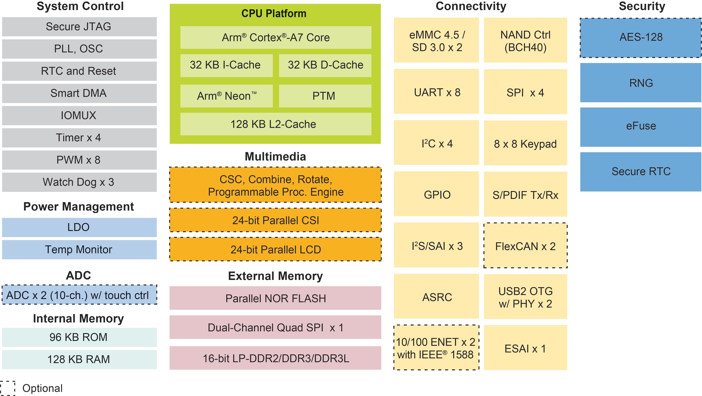
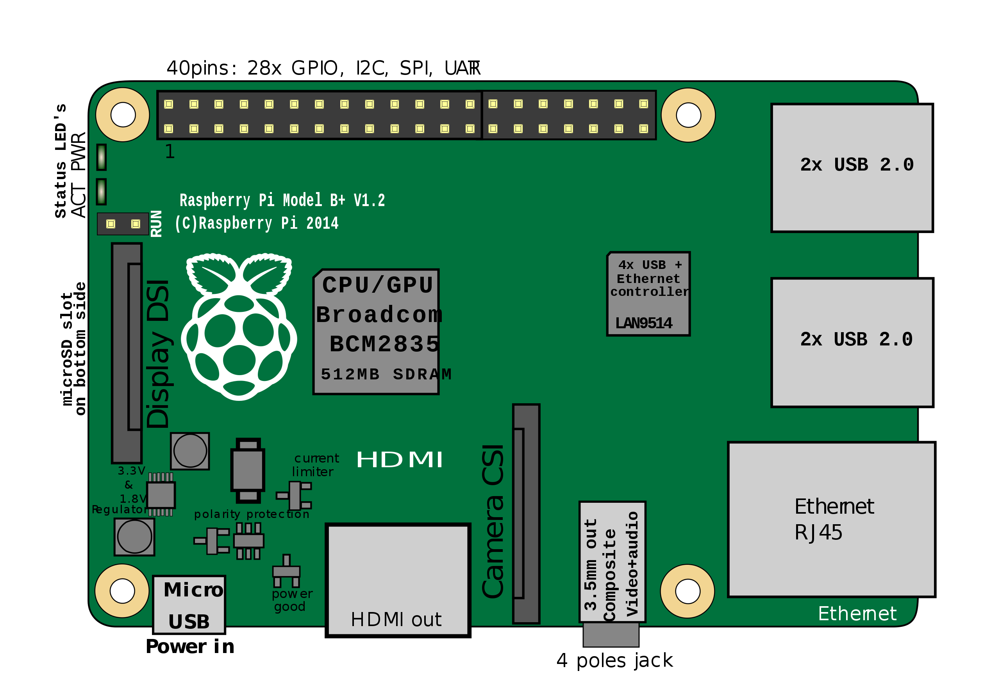

# Platforms

## Hardware

### i.MX6ULL Single-Core (`hw-imx6ull`)

The [i.MX6ULL][imx6ull] is a power efficient and cost-optimized applications
processor family featuring an advanced implementation of a single Arm Cortex-A7
(`ARMv7-A`) core with `A` standing for _Application_ profile, which operates at
speeds up to 900 MHz. NXP vendor have an [evaluation kit][mcimx6ull-evk] ready
for this processor.

### Raspberry Pi B+ (`hw-rpi`)

This environment aims at proving software components on a single-board computer
with a 32-bit ARM processor to get closes to the final hardware.

Watch out, the Raspberry Pi 2 Model B is VERY different from the Raspberry Pi
Model B - check for that "2" when checking accessories and compatibility!

For further details and comparison, read the [Adafruit tutorial][adafruit-pis].

The Broadcom BCM2835 SoC used in the first generation Raspberry Pi includes
a 700 MHz ARM1176JZF-S processor, VideoCore IV GPU, and 512 MiB RAM.

The Broadcom BCM2836 SoC used in the second generation Raspberry Pi 2 includes a
quad-core Cortex-A7 CPU running at 900 MHz, same VideoCore IV GPU, and 1 GiB RAM.

For further details and comparison, read the [Wikipedia page][wikipedia-pis].

In our situation, a Rpi model B+ v1.2 is kind of closer to the targeted
i.MX6ULL. It is a single-core CPU but runs a ARMv6 instead of ARMv7. But the
linux kernel will make the abstraction and thus it should not make any
difference. It is better to have the same number CPU cores and less RAM.
Moreover, it is the only one well supported by QEMU with networking working.

In our situation, the Raspberry Pi is running the Raspbian Stretch OS.

## Virtual Machine

### QEMU Raspberry Pi (`qemu-rpi`)

This environment aims at quickly proving software components on an emulated
32-bit ARM processor. Software components should run identically on both
`qemu-rpi` and `hw-rpi`.

Read detailed instructions in [Emulate Raspbian with QEMU](emulate-raspbian-qemu.md).

In our situation, the Raspberry Pi is running the Raspbian Stretch OS.

### VirtualBox Ubuntu 18.04 LTS (`vm-ubuntu`)

This environment aims at being replicable. Setup instructions will take the form
of a `Vagrant` file.

### Docker Container (`vm-docker`)

At some point, a docker environment might be needed for easier and faster
cross-compiling for the hardware platforms.

[imx6ull]:https://www.nxp.com/products/processors-and-microcontrollers/arm-processors/i-mx-applications-processors/i-mx-6-processors/i-mx-6ull-single-core-processor-with-arm-cortex-a7-core:i.MX6ULL
[mcimx6ull-evk]:https://www.nxp.com/design/development-boards/i-mx-evaluation-and-development-boards/evaluation-kit-for-the-i-mx-6ull-and-6ulz-applications-processor:MCIMX6ULL-EVK
[adafruit-pis]:https://learn.adafruit.com/introducing-the-raspberry-pi-2-model-b
[wikipedia-pis]:https://en.wikipedia.org/wiki/Raspberry_Pi
